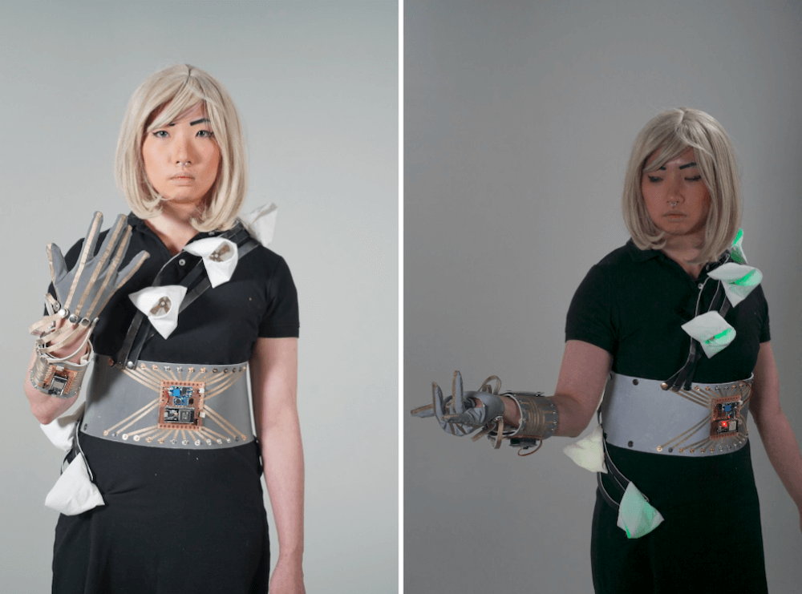
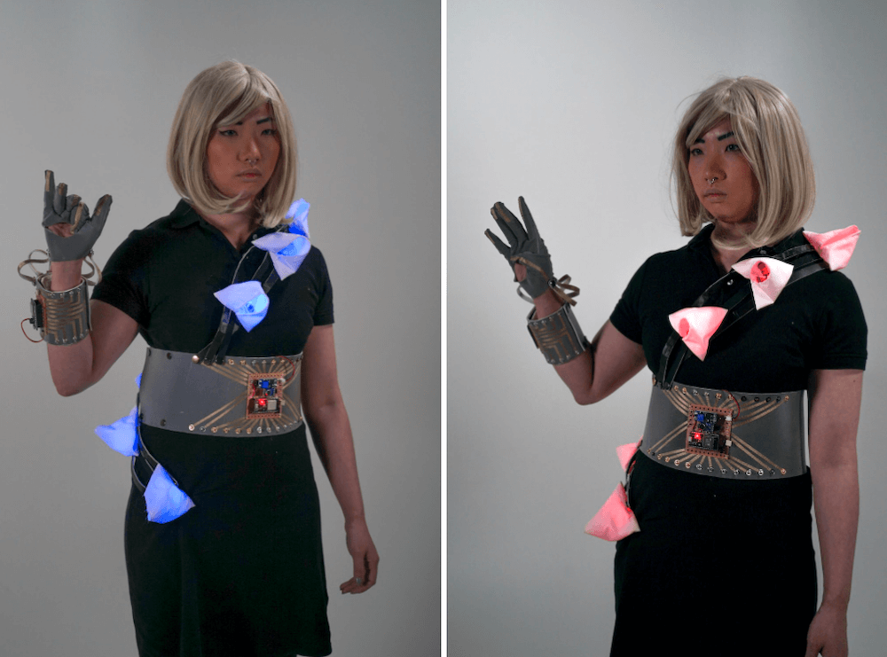
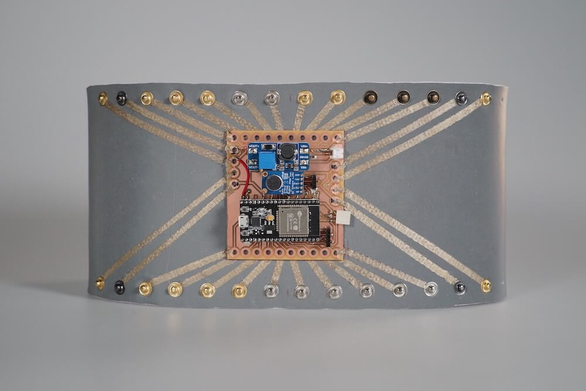
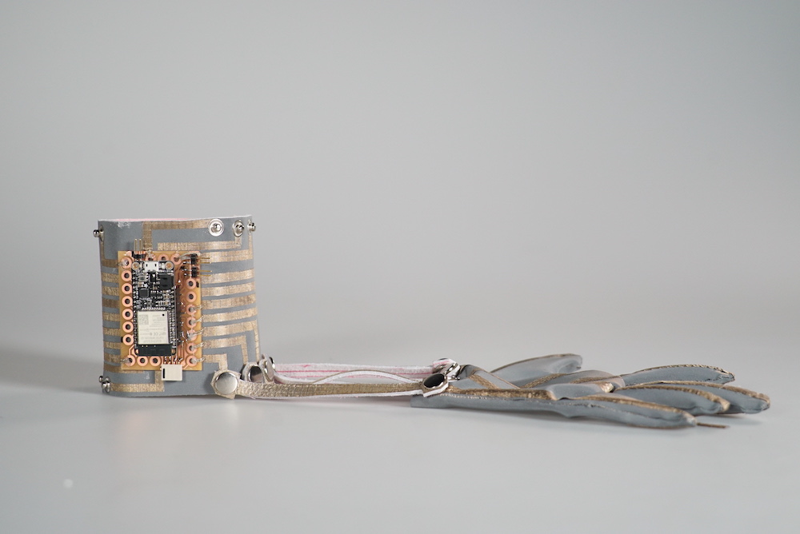
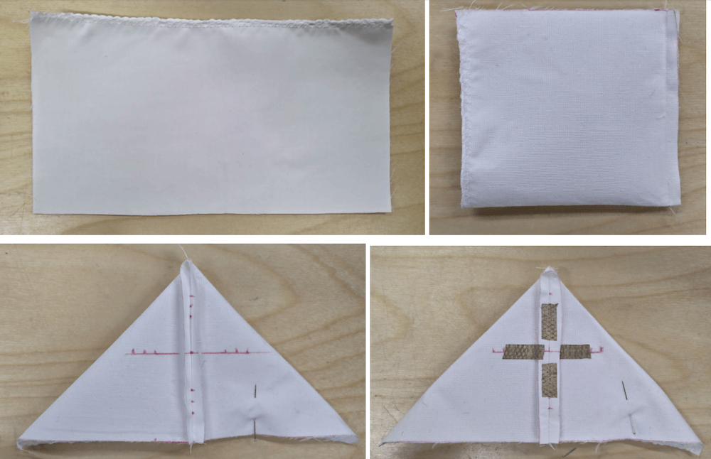
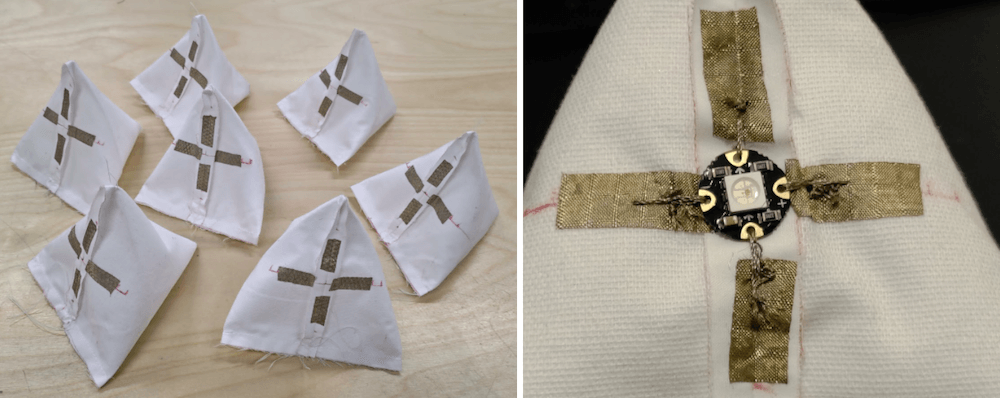
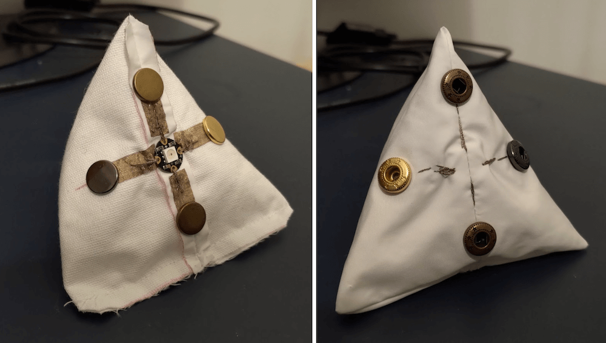
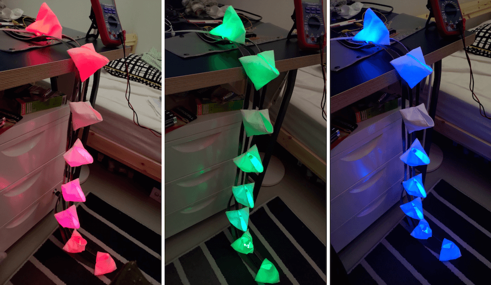

# Inner Voice

- Wearable Technology and Functional Wear Study Project.
- Materials: ESP32 / Flora RGB Smart NeoPixel / Conductive Fabrics & Yarns
- Language: Arduino
- **More details of the project (Demo Video): https://wantinghsieh.com/inner-voice-learning-diary/**

---

## Build

**[Link to the documentation page.](https://fabacademy.wantinghsieh.com/assignment/16-wildcard-week)**

## Belt Controller

## Bracelet Controller

## WS2812B Trianguler Light Modules

---
